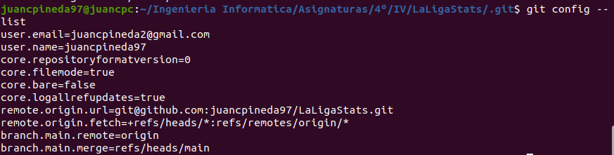

# Configuración git
Aquí mostraré como he configurado git en mi PC

## Configuración nombre y correo
Para que en mis commits aparezca mi nombre y correo, he tenido que configurarlos en mi PC manualmente; se puede comprobar en la siguiente captura con la ejecución del comando `git config --list`. Además, se puede ver en la captura que también se ha configurado el acceso por ssh con claves público/privadas, ya que como se indica, la url de 'origin' está con formato de *ssh* 

 
