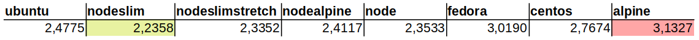
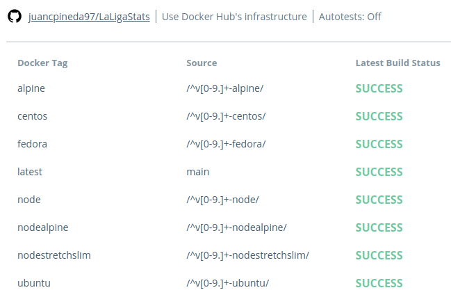

# Documentación Docker

## Elección imagen base
Para formar una imagen con la que crear un contenedor para ejecutar la aplicación, usaré un [Dockerfile](../Dockerfile), en el cuál estarán las órdenes necesarias para crearla. Una parte muy importante es elegir una imagen base, pero, ¿cuál elegir?.
En un principio, opté por la imagen oficial de Node.js, ya que así no tendría que ejecutar órdenes extra para instalar node ni npm, y además, no tendria mucho software extra no necesario. Esta imagen consta de varias versiones, entre las que están la versión base `node`, `node-alpine`, `node-slim`, y `node-stretch-slim`. Todas ellas se diferencian en el software que viene instalado en la imagen, siendo las últimas las más livianas. Por ello, ya que no necesito software adicional aparte de node, npm y las dependencias que se instalan, decidí optar por `node-stretch-slim`. Pero para probar que esta es la más óptima, decidí hacer una prueba de tiempo de ejecución de cada imagen con una imagen base diferente. Por lo que se ha realizado una prueba de tiempo de ejecución en la que se ejecutan los tests 50 veces, se miden los tiempos y se hace la media. Para ello se formará una imagen diferente con cada imagen base, con su correspondiente Dockerfile. Como imágenes base se usarán las anteriores mencionadas, además de otras imágenes base de diferentes distros de linux, como `ubuntu` en la versión 20.04, `alpine`, `fedora`, y una imagen de `centos` con node ya instalado. Los resultados de la prueba son los siguientes (expresados en segundos):

Como se puede apreciar, la más rápida ha sido la imagen con `node-slim` de base, con lo que esa usaré a partir de ahora y en desarrollos futuros. A continuación, pondré enlaces a los diferentes Dockerfile de las imágenes probadas; a la imagen con node-slim de base se le asignará el tag `latest`, ya que es en la que se trabajará a partir de ahora:
- [`latest`](https://github.com/juancpineda97/LaLigaStats/blob/main/Dockerfile)
- [`alpine`](https://github.com/juancpineda97/LaLigaStats/blob/ced1d26ba574568d3c7129427bab49872a942b11/Dockerfile)
- [`centos`](https://github.com/juancpineda97/LaLigaStats/blob/07fc7a1f92709d1c4408e06950d8d8c1059c9e80/Dockerfile)
- [`fedora`](https://github.com/juancpineda97/LaLigaStats/blob/df4c4cdae483b4cf6248bf7623fdc894b13a4479/Dockerfile)
- [`node`](https://github.com/juancpineda97/LaLigaStats/blob/2bfc00fee509604f5c23086beeb27c17e95bc7d4/Dockerfile)
- [`nodealpine`](https://github.com/juancpineda97/LaLigaStats/blob/0043bf76556c0f9767925a659277e45aac15b21c/Dockerfile)
- [`nodestretchslim`](https://github.com/juancpineda97/LaLigaStats/blob/da79adcf3e205e82a98da060632e996df47b38e8/Dockerfile)
- [`ubuntu`](https://github.com/juancpineda97/LaLigaStats/blob/335444a31149f52765640c1454a206af62e6f407/Dockerfile)

## Dockerfile

Para la elaboración del [Dockerfile](../Dockerfile) se ha intentado seguir unas buenas prácticas y optimización de la imagen, que se describen a continuación:
- Se usa desde un principio el usuario node para realizar la instalación sin usar el usuario root. [(commit)](https://github.com/juancpineda97/LaLigaStats/commit/b0c118f4d2f603d0d0cd17f52462e179c2c61f50)
- Copio el archivo de dependencias [package.json](../package.json) en el home del usuario de node y no en la raíz del sistema, ya que esta sería una mala práctica. Además, lo copio con propietario y grupo: node para luego poder eliminarlo sin tener que ser superusuario. [(commit)](https://github.com/juancpineda97/LaLigaStats/commit/1fa471ebb3b21d61534493fd25dff11bc01996a8)
- Se cambia de directorio de trabajo a /home/node, ya que ahí se hará la instalación de las dependencias (aquí se ubicará la carpeta node_modules). [(commit)](https://github.com/juancpineda97/LaLigaStats/commit/611a1694d3de190cac6c1cbc778cf3db814e570b)
- Se instalan las dependencias dentro de /home/node, y luego se borran los ficheros package*.json para liberar espacio. Además, estas dos instrucciones se ejecutan en la misma capa para ahorrar espacio. [(commit)](https://github.com/juancpineda97/LaLigaStats/commit/a05f085a3baa79fb4df4bcef1eb68a3db8eac665)
- Se indica la ubicación de node_modules dentro de /home/node. [(commit)](https://github.com/juancpineda97/LaLigaStats/commit/5f07a229815faae8b6de5e0a50f9e13faafaa909)

Tras la inclusión de grunt en el proyecto, se ha tenido que modificar el [Dockerfile](../Dockerfile) ya que la instalación de grunt es global, y ahora sigue los siguientes pasos:
- Se copia el archivo de dependencias [package.json](../package.json).
- Aprovechando que estoy con el usuario root, instalaré grunt de forma global, luego crearé la carpeta *node_modules* en la raíz y le cambiaré el propietario al usuario node, para así poder instalar las dependencias en esta carpeta sin privilegios de usuario.
- Se cambia al usuario node para instalar las dependencias
- Se cambia al usuario root para borrar package.json y luego se vuelve al usuario node para ejecutar los tests
- Se indica la ubicación de node_modules dentro de /home/node.
- Se indica que los tests se ejecutará usando la orden de grunt creada.

## Dockerhub
Todas estas imágenes se han subido a Dockerhub, para ello, primero hay que crearse una cuenta en este sitio web, y luego, se creará un nuevo [repositorio](https://hub.docker.com/repository/docker/juancpineda97/laligastats), el cuál tendrá el mismo nombre que el repositorio en GitHub (pero con el nombre en minúsculas). Luego, se configurará la visibilidad de éste a pública, y se enlazará, conectando con nuestra cuenta de GitHub, a nuestro repositorio. Lo interesante de esta herramienta, además de que nuestras imágenes estén disponibles para su uso por cualquiera, es automatizar el proceso de creación de estas imágenes cuando hacemos push a nuestro repositorio en GitHub. Esta acción se ha configurado de la siguiente forma:

De forma que, cada vez que se realize un `push` a la rama main del repositorio en Github, se creará de nuevo la imagen con el tag `latest` (recordar que esta imagen usa `node-slim` como base), por lo que esta será siempre la más actualizada. Y, para las otras versiones con diferentes imágenes base, se creará su correspondiente imagen cuando detecte que se ha creado en el repositorio un tag del tipo `[número de versión]-[imagen base]` con el tag correspondiente a la imagen base. En esta [sección](https://github.com/juancpineda97/LaLigaStats#tags-disponibles) se incluyen los tags disponibles, con un enlace a su página en Dockerhub, donde se indica como descargarlos.