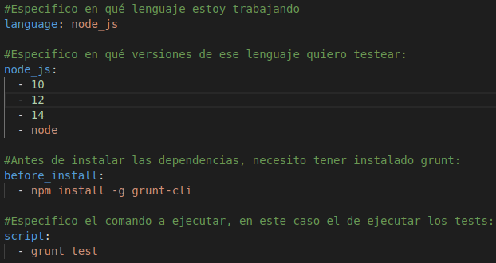
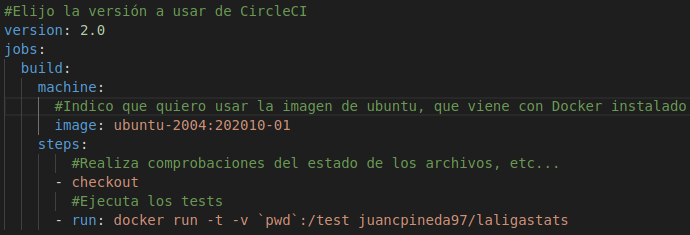
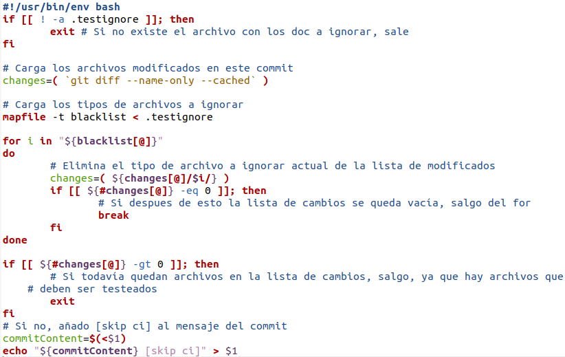

# Integración Continua

En este documento explicaré los elementos y la motivación a su uso que he utilizado para añadir Integración Continua a mi proyecto.

## Travis CI
En primer lugar, he usado el sistema de integración continua Travis CI, ya que me permite conectar mi repositorio de GitHub para que realice las pruebas cuando detecte un push o pull request a este repositorio, y además, es compatible con Node.js, en el cuál estoy trabajando. Las pruebas realizadas en este sistema consistirán en la ejecución de los tests disponibles en el proyecto, así se podrá comprobar que tras un cambio en el código, el proyecto sigue funcionando correctamente. Para ello, primero hay que darse de alta en la web de travis, conectar con GitHub e indicar en qué repositorio quiero realizar las pruebas, además, hace falta indicarle a Travis qué órdenes o pasos debe ejecutar para realizar los tests, esto se hace con el archivo [.travis.yml](../.travis.yml), que está configurado de la siguiente forma:

En el cuál, se indica a travis que realice los siguientes pasos:
- Primero, se indica que lenguaje voy usar, en este caso, node.js.
- Luego, indico en qué versiones de este lenguaje quiero probar mi aplicación (se realizará una prueba diferente en travis por cada lenguaje), añado la versión más reciente con `node` y luego añado las versiones `14`, `12` y `10`, las cuáles son las que están en estado *Active LTS* o *Maintenance LTS*.
- Después, debo indicar que antes de que se ejecute la orden para instalar las dependencias, se debe instalar globalmente grunt-cli, ya que es necesario para ejecutar el administrador de tareas. En la versión anterior del proyecto había que instalar también globalmente jest para poder realizar los tests, sin embargo, se ha [cambiado](https://github.com/juancpineda97/LaLigaStats/issues/55) para evitar tenerlo que instalar globalmente.
- Por último, se indica la orden para ejecutar los tests del proyecto, si se ejecutan los tests satisfactoriamente y con resultado positivo, se pasará la prueba de travis, en otro caso, dará fallo en la prueba e indicará qué es lo que ha fallado.

## Circle CI
Voy a usar como segundo sistema de integración continua Circle CI, ya que éste por ejemplo trabaja con Dockers y destaca en su rapidez de ejecución. La configuración es similar a Travis, se crea una cuenta en Circle Ci, se conecta a Github y se selecciona el repositorio en el que se quiere trabajar, el cuál debe tener un archivo de configuración similar al de Travis: [config.yml](../.circleci/config.yml). A diferencia de la prueba con Travis, en este sistema se ejecutarán los tests de la aplicación pero aprovechando el contenedor de la propia aplicación alojado en DockerHub. El archivo de configuración es el siguiente, como se puede ver, sería bastante sencillo:

- Primero, se elige la versión de Circle Ci que quiero usar.
- Luego, se indica una nueva tarea, build, en la que se indica primero que usaré la imagen de mi proyecto como entorno de ejecución.
- Por último, se indican los pasos de esta, los cuáles son realizar checkout de los archivos, etc... y luego ejecutar la orden `grunt test` para ejecutar los tests. Al igual que en Travis, si se ejecutan los tests satisfactoriamente y con resultado positivo, se pasará la prueba, en otro caso, dará fallo en la prueba e indicará qué es lo que ha fallado.

## GitHub Actions
Además, usaré en el propio repositorio las Github Actions; se ha configurado para ejecutar un test que comprueba la ortografía de la documentación basada en un diccionario, [words.dic](../words.dic). Este test sólo se lanzará si se detecta que en el push se ha cambiado un archivo con extensión `*.md` o el propio diccionario. La fuente del test es la [siguiente](https://github.com/JJ/IV/blob/master/.github/workflows/check-readme.yml).

## Control de tests
Ya que tanto Travis como Circle tienen un sistema de créditos limitado en el plan gratuito, es conveniente que no se lanzen los tests de estas webs si se ha cambiado sólo la documentación, por ejemplo, para evitar gastar créditos innecesariamente. Manualmente esto se puede hacer añadiendo al mensaje de commit [skip ci], pero esto es algo que conviene automatizar, para ello he hecho uso de git hooks, un script que se ejecutará cada vez que se cree un commit localmente, basado en [esta fuente](https://gist.github.com/felicianotech/12a4b38c594fcf3d3999de2c01f7d05e#gistcomment-3078719):

El cuál funciona de la siguiente forma: cada vez que se crea un nuevo commit, se lanza este script, el cuál analiza los archivos que han sido modificados en ese commit, y si sólo se han modificado archivos que coinciden con las reglas guardadas en el archivo [.testignore](../.testignore) (en este caso de tipo `*.md` o `*.png`), se modifica el mensaje de commit añadiendo al final `[skip ci]`  para que al hacer push no se ejecuten ni Travis ni Circle de este commit; en otro caso, no se añadirá nada al mensaje de commit y al hacer push, se ejecutará éstos dos sistemas.