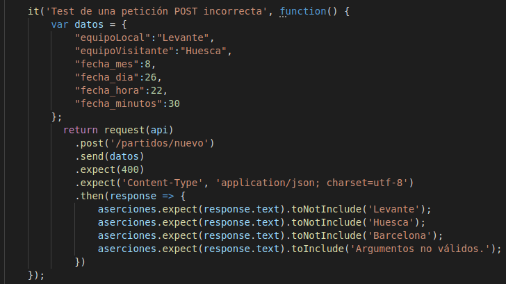

# Microservicio

## Resumen
Se ha creado un microservicio para las funcionalidades de la aplicación, el cuál funciona como una API REST a la que realizar peticiones. Para ello, se ha usado el framework Express, añadiendo además middlewares para el control de errores y generación de logs.

## Elección framework
Para realizar la API usaré un framework, el cuál me facilitará la tarea. Para la elección he comparado lo que me ofrecen varios Framework para elegir el que se ajuste mejor a mis necesidades. Estos son Express, Sails, Meteor y Loopback. Estos 4 son de diferentes tipos, siendo Express y Sails frameworks MVC, Meteor un framework Full-stack y Loopback un framework API REST. Debido a esto, el primero que descartaré será Meteor, ya que aunque trae integrado más funcionalidades extra cómo un motor de plantillas, estas sobran en esta fase del proyecto ya que la API no está enfocada a la creación y uso de un front-end para la aplicación; además, este framework destaca negativamente frente a los demás ya que es el más lento de éstos. El siguiente que descartaré será Loopback, ya que este no implementa el paradigma MVC como lo hacen los demás, el cuál me permitiría crear modelos fácilmente para almacenar los datos de la aplicación de manera sencilla, que, aunque en este punto no se usa, la idea de usar esta técnica me parece bastante interesante para implementar en un futuro, por lo cuál estaría bien elegir un framework que cuente con ello; además, Loopback tampoco destaca por su velocidad. Así que mi decisión está entre Express o Sails; los dos me ofrecen características que o bien necesita mi proyecto o vendrán bien en un futuro, sin embargo, Express es más rápido que Sails, y además, para el uso de Sails debo crear un proyecto nuevo de éste, lo que conlleva que se añadirán archivos que uas este framework no necesarios para realizar la API, sin embargo, con Express basta con crear un archivo .js en el que se importará con require este paquete para usarlo, lo cuál hace que se ahorre la adicción de *bloatware* en el proyecto. Esto sumado a que es más rápido, y que además, tiene una gran comunidad detrás, hace que elija **Express** como framework para crear la API. En el [ejercicio 2](https://github.com/juancpineda97/Ejercicios-IV/blob/main/ejercicios/tema6.md#ejercicio-2) realizado del tema de microservicios he explicado cómo se instala este.

## Diseño API
Antes de empezar a crear la API diseñaré la estructura que tendrá y que rutas tendrá disponibles. Me he dado cuenta de que con la API consultaré, modificaré o eliminaré datos u objetos de las instancias de la aplicación en ejecución (es decir, por ejemplo, un equipo de la clase [Equipo](../src/equipo.js) o un jugador de la clase [Jugador](../src/jugador.js)), y, puesto que en mi aplicación se trabaja con una liga formada por varios equipos y jugadores, he visto necesario crear una clase que englobe a los equipos de una liga y sus jugadores junto con los partidos de ésta, además de los métodos correspondientes para realizar las operaciones sobre estos equipo, jugadores o partidos. Por ello  he creado la clase [Liga](../src/liga.js), la cuál consta de una lista de los equipos de la liga correspondiente (cada equipo cuenta con una lista con sus jugadores), una lista con los partidos de esta, y los métodos correspondientes para el manejo de estos datos. Por supuesto, se han creado los correspondientes [tests](../test/equipo-jugador.test.js) unitarios para esta clase.

Cada método de esta clase se ajustará a las necesidades de su correspondiente historia de usuario, por lo que en la programación de la API sólo bastará con importar esta clase y usar sus métodos para cumplir las funciones de la API. Esto significa que se añade una capa de abstracción, ya que se separa la lógica de negocio asociada a cada historia de usuario, que estará en la clase Liga, del diseño de la API.

Una vez implementada esta clase, realizaré el diseño de las rutas que tendrá la API, el método de la petición y su HU asociada. Estas serán:

- [**HU01**](https://github.com/juancpineda97/LaLigaStats/issues/4) - Ver jugadores de un equipo:
    - **GET /equipos/:nombre_equipo**
- [**HU02**](https://github.com/juancpineda97/LaLigaStats/issues/5) - Mostrar datos del jugador:
    - **GET /jugadores/:nombre_jugador**
- [**HU03**](https://github.com/juancpineda97/LaLigaStats/issues/40) - Mostrar información sobre un partido:
    - **GET /partidos/:nombre_equipo**
- [**HU04**](https://github.com/juancpineda97/LaLigaStats/issues/80) - Mostrar ranking de los equipos más valiosos:
    - **GET /ranking**
- [**HU05**](https://github.com/juancpineda97/LaLigaStats/issues/92) - Modificar equipo de un jugador:
    - **PUT /jugadores/traspaso**
- [**HU06**](https://github.com/juancpineda97/LaLigaStats/issues/93) - Añadir nuevo partido:
    - **POST /partidos/nuevo**

Además, cada función de la API tendrá sus correspondientes [tests de integración](../test/integracion.test.js) para comprobar el funcionamiento conjunto de todos los elementos de la app. A continuación se explica en detalle cada función de la api, la cuál está implementada en el archivo [api.js](../api_rest/api.js).

### [**HU01**](https://github.com/juancpineda97/LaLigaStats/issues/4)
Esta historia de usuario persigue mostrar los jugadores de un equipo dado, para ello se ha diseñado el método [verJugadoresEquipo](https://github.com/juancpineda97/LaLigaStats/blob/1d9c57d8d7f0aa9af65dd0bb96ffb4dd2abcf933/src/liga.js#L85). La función de la API asociado a esta historia de usuario es el [siguiente](https://github.com/juancpineda97/LaLigaStats/blob/1d9c57d8d7f0aa9af65dd0bb96ffb4dd2abcf933/api_rest/api.js#L61):

El funcionamiento es el siguiente: se pasa por parámetro en la URL el nombre del equipo, y si el equipo existe, se devuelve la lista de jugadores de este equipo en formato json con código de estado 200:

En cambio, si no se encuentra el equipo, se devuelve un error 404 indicando el motivo con su código de error correspondiente:

El test de integración asociado a esta función es el siguiente:

### [**HU02**](https://github.com/juancpineda97/LaLigaStats/issues/5)
Esta historia de usuario corresponde a la funcionalidad de mostrar los datos de un jugador dado, el método correspondiente es [verJugador](https://github.com/juancpineda97/LaLigaStats/blob/1d9c57d8d7f0aa9af65dd0bb96ffb4dd2abcf933/src/liga.js#L142). La función de la API es la [siguiente](https://github.com/juancpineda97/LaLigaStats/blob/1d9c57d8d7f0aa9af65dd0bb96ffb4dd2abcf933/api_rest/api.js#L73):

Si existe algún jugador que cumpla con el nombre que se ha pasado por parámetro, devolverá los datos de estos jugadores en formato json con código de estado 200:

En cambio, si no existe ningún jugador que cumpla con el criterio del nombre, devolverá un error con código 404:

El test de integración asociado a esta función es el siguiente:

### [**HU03**](https://github.com/juancpineda97/LaLigaStats/issues/40)
Esta historia de usuario corresponde a la funcionalidad de mostrar la información de un partido, el método correspondiente es [verPartido](https://github.com/juancpineda97/LaLigaStats/blob/1d9c57d8d7f0aa9af65dd0bb96ffb4dd2abcf933/src/liga.js#L195). La función de la API es la [siguiente](https://github.com/juancpineda97/LaLigaStats/blob/1d9c57d8d7f0aa9af65dd0bb96ffb4dd2abcf933/api_rest/api.js#L85):

Se buscará en la lista de partidos los partidos en los que juegue algún equipo que coincida con el criterio del nombre de equipo pasado por parámetro, y se devolverá una lista con los partidos que coinciden y su información en formato json con código de estado 200:

En cambio, si no existe ningún partido en el que juegue el equipo que cumpla con el criterio de nombre de equipo indicado, devolverá un error con código 404:

El test de integración asociado a esta función es el siguiente:

### [**HU04**](https://github.com/juancpineda97/LaLigaStats/issues/80)
Esta historia de usuario corresponde a la funcionalidad de mostrar un ranking de los equipos mas valiosos conforme el valor de sus jugadores, el método correspondiente es [verRankingEquipos](https://github.com/juancpineda97/LaLigaStats/blob/1d9c57d8d7f0aa9af65dd0bb96ffb4dd2abcf933/src/liga.js#L250). La función de la API es la [siguiente](https://github.com/juancpineda97/LaLigaStats/blob/1d9c57d8d7f0aa9af65dd0bb96ffb4dd2abcf933/api_rest/api.js#L97):

Se sumará el valor de los jugadores de cada equipo y se ordenarán para formar el ranking que se devolverá en formato json con código de estado 200:

También está la opción de que se devuelva en formato de texto plano:

**NOTA:** Tanto esta función, como las tres anteriores, tienen la opción de devolver también la respuesta en texto plano, haciendo la información más legible para el usuario. Esto dependerá del campo `Accept` de la cabecera de la petición recibida, si este campo indica `text/plain` se devolverá la respuesta en texto plano; si el campo no aparece o tiene otro valor diferente, se devolverá la respuesta en formato JSON.

El test de integración asociado a esta función es el siguiente:

### [**HU05**](https://github.com/juancpineda97/LaLigaStats/issues/92)
Esta historia de usuario corresponde a la funcionalidad de cambiar el equipo de un jugador dado, es decir, realizar un traspaso, por ello se usa el método **PUT**, y los parámetros se pasarán en el `body` de la petición. El método correspondiente es [traspasoJugador](https://github.com/juancpineda97/LaLigaStats/blob/1d9c57d8d7f0aa9af65dd0bb96ffb4dd2abcf933/src/liga.js#L305). La función de la API es la [siguiente](https://github.com/juancpineda97/LaLigaStats/blob/1d9c57d8d7f0aa9af65dd0bb96ffb4dd2abcf933/api_rest/api.js#L108):

Se buscará al jugador por su nombre, y el nombre del equipo al que se quiere traspasar, y si los dos existen, se modificará el campo del equipo en el jugador y se añadirá a la lista de jugadores del nuevo equipo, para devolver el jugador modificado en formato json con código de estado 200:

Por ejemplo, si no existe ningún equipo que cumpla con el nombre indicado, devolverá un error con código 404:

O, si no se han indicado bien los parámetros en el body, se devolverá un error con código 400:

El test de integración asociado a esta función es el siguiente:

### [**HU06**](https://github.com/juancpineda97/LaLigaStats/issues/93)
Esta historia de usuario corresponde a la funcionalidad de añadir un nuevo partido, por ello se usa el método **POST**, y los parámetros se pasarán en el `body` de la petición. El método correspondiente es [aniadePartido](https://github.com/juancpineda97/LaLigaStats/blob/1d9c57d8d7f0aa9af65dd0bb96ffb4dd2abcf933/src/liga.js#L398). La función de la API es la [siguiente](https://github.com/juancpineda97/LaLigaStats/blob/1d9c57d8d7f0aa9af65dd0bb96ffb4dd2abcf933/api_rest/api.js#L122):

Se añadirá el partido con los datos indicados a la lista de partidos, y se devolverán los datos del partido recién creado en formato json con código de estado 200:

Además, si no existe ningún equipo que cumpla con el nombre indicado, tanto el equipo local como el visitante, devolverá un error con código 404:

O, si no se han indicado bien los parámetros en el body, se devolverá un error con código 400:

El test de integración asociado a esta función es el siguiente:

