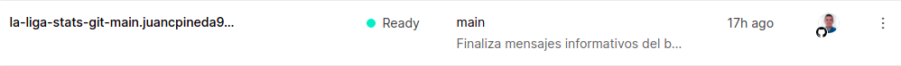
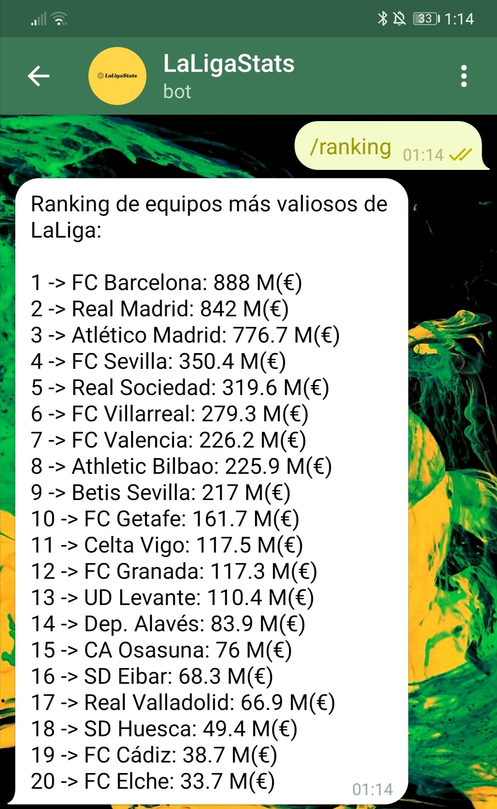

# Serverless

## Resumen
Para este proyecto, se van a implementar dos funciones serverless diferentes, relacionadas con las historias de usuario, y cada una funcionará en un servicio serverless diferente, en este caso, Vercel y Netlify. Además, se implementará otra función serverless que ejecutará el bot de telegram creado, el cuál tendrá disponibles algunas de las funciones del proyecto relacionadas con las HU. A todo esto, se le suma el avance en el código, explicado también más adelante.

## Función Ver jugadores de un equipo
Esta función serverless se corresponde con la siguiente [Historia de usuario](https://github.com/juancpineda97/LaLigaStats/issues/4). Funcionará de tal forma que al pasar por parámetro el nombre de un equipo, se mostrarán los jugadores de éste. Esta función estará desplegada en Vercel, para ello, habrá que configurar este servicio para que se conecte con el repositorio en Github, y realizar la configuración para conectar el repositorio local con el alojado en Vercel, para así, poder realizar desde nuestro PC el despliegue en esta plataforma, tal y como se indica en los ejercicios realizados [1](https://github.com/juancpineda97/Ejercicios-IV/blob/main/ejercicios/tema5.md#ejercicio-1) y [2](https://github.com/juancpineda97/Ejercicios-IV/blob/main/ejercicios/tema5.md#ejercicio-2) del tema de serverless. Una vez dado de alta en Vercel y añadido el repositorio del proyecto cómo se indica en el ejercicio 1, se descargará el sdk de vercel con el comando `npm install -g vercel` y, una vez descargado, se iniciará sesión como aparece en la imagen del ejercicio 1, y, una vez iniciada sesión, se enlazará el repositorio local con el existente en Vercel (que es el mismo de github, ya que se ha configurado anteriormente desde la web) como se puede apreciar en la siguiente imagen:

Una vez hecho esto, se podrá realizar el despliegue en Vercel cómo se ve en este ejemplo:

Además, también se podrá hacer un despliegue local, antes de ser puesto en fase de producción, que es muy útil para cuando se está en desarrollo y se quiere probar el funcionamiento de nuevos cambios antes de pasar a estar disponibles en línea, por ejemplo:

Para que se realice el despliegue de la función deseada, esta estará, tal y como pasaba en el ejemplo del ejercicio 2, en el directorio [/api/getEquipo.js](../api/getEquipo.js). La función es la siguiente:

Cómo se puede ver, no es una función compleja, en ella se obtiene el equipo que es pasado por parámetro, se llama a la función que obtiene la lista de jugadores de este equipo, y se devuelve un json con los datos de los jugadores del equipo, cómo en el ejemplo que se ve a continuación. Si ocurre algún error, se devolverá el código y mensaje de error correspondientes.

La función, con un ejemplo que muestra a los jugadores del FC Barcelona, está disponible en el siguiente enlace:

https://la-liga-stats.juancpineda97.vercel.app/api/getEquipo.js?equipo=barcelona

Cómo se puede ver, como parte de la lógica de negocio se hace uso de la función *getJugadoresEquipo(...)* del archivo [utils.js](../src/utils.js), ya que esta funcionalidad se usará más adelante en el bot en telegram, por lo que era conveniente crear un archivo con esta en vez de programarla directamente en la función de Vercel.

Por último, destacar que la integración contínua está presente en esta función, ya que cada vez que se realiza un push al repositorio de la aplicación, automáticamente Vercel realiza un nuevo despliegue de esta, cómo se ve en el siguiente ejemplo de un commit en el repositorio:

## Función Ver ranking de equipos más valiosos
Esta función serverless se corresponde con una nueva HU creada, que está relacionada con [mostrar un ranking de los equipos más valiosos](https://github.com/juancpineda97/LaLigaStats/issues/80) de LaLiga, considerando la suma de los valores de los jugadores que integran un equipo. Esta función estará alojada en Netlify, para ello, habrá que realizar los pasos de darse de alta, instalación y configuración tal y cómo se explica detalladamente en el [ejercicio 3](https://github.com/juancpineda97/Ejercicios-IV/blob/main/ejercicios/tema5.md#ejercicio-3) desarrollado. Cómo se puede ver en el ejercicio, en el primer despliegue en local, se enlazará el proyecto local con el alojado en Netlify, una vez realizado esto, ya se podrán realizar despliegues como se observa a continuación:

Al igual que pasaba con Vercel, también se pueden realizar despliegues localmente:

Ya que cómo se ha indicado que las funciones de Netlify estarán en el directorio */functions* , se creará el archivo [/functions/getRanking.js](../functions/getRanking.js) con la función de Netlify para mostrar el ranking de equipos, la cuál será la siguiente:

Esta función es más simple todavía que la anterior, ya que en ella se llamará a la función *getRankingValorEquipos()* del archivo [utils.js](../src/utils.js) cómo pasaba en la función anterior, ya que esta función implementará la lógica de negocio, y se devolverá el resultado en un string (que estará escrito en formato JSON) con el ranking de los equipos.

La función estará disponible en el siguiente enlace:

https://laligastats.netlify.app/.netlify/functions/getRanking

Y devolverá, por ejemplo, la siguiente salida:

También destacar que, cómo pasaba anteriormente, en Netlify también se asegura la integración contínua, ya que cada vez que se realiza un push a el repositorio en Github, se realiza automáticamente un despliegue de la función en Netlify.

## Bot Telegram
Además, se creará un bot de Telegram, el cuál podrá realizar las funciones descritas anteriormente, mostrar los jugadores de un equipo y el ranking de equipos más valiosos. Para ello, se ha creado una nueva función de Netlify, [botTelegram.js](/functions/botTelegram.js), que funcionará de forma similar a la función creada anteriormente. Esta función se ejecutará y realizará una tarea u otra dependiendo del comando que envíe el usuario. Los comandos disponibles son: **/ranking**, que muestra el ranking de los equipos más valiosos de LaLiga, **/equipo [nombre equipo]** que muestra los jugadores del equipo indicado, y **/help** que muestra los comandos disponibles.

Para implementar las funciones del bot, en un principio se pensó en realizar una llamada a la función severless correspondiente, y así aprovechar que ya están implementadas; sin embargo, se ha optado por llamar directamente a la función correspondiente del archivo [utils.js](../src/utils.js), ya que así se ahorra el tiempo de ejecución correspondiente a la llamada de una función API que realizaría lo mismo que al llamar directamente a la función del archivo utils.js

Una vez creada la función del bot de Telegram, y realizado el despliegue, se creará el bot de telegram en sí fácilmente con la ayuda de otro bot oficial, [BotFather](https://t.me/BotFather), el cuál nos facilitará un *token*, que nos servirá, para indicar con el siguiente comando, que cada vez que se envíe un mensaje al bot, se ejecute la función serverless en Netlify, es decir, se relaciona esta función con el bot de Telegram en sí (técnicamente llamado WebHook):

*(Se oculta el token del bot, ya que es muy importante que éste no se comparta)*

Una vez realizado esto, ya se puede usar el bot, aquí está el enlace a éste: [LaLigaStats_bot](https://t.me/LaLigaStats_bot). Aquí se pueden apreciar algunas capturas del funcionamiento de éste:

Además, destacar que el funcionamiento del bot de Telegram estará siempre actualizado, ya que cuando se realiza un push al repositorio en GitHub, Netlify realiza automáticamente un nuevo despliegue tal y cómo con la otra función.

## Avances del código
En esta etapa del proyecto, se han realizado los siguientes avances del código:
- Se ha incluido el archivo [equipos.json](../data/equipos.json), el cuál contiene los datos de los equipos de LaLiga y sus jugadores que usará la aplicación.
- Sin embargo, lo más destacado es que este archivo se genera automáticamente ejecutando el archivo [getData.js](../src/getData.js), el cuál obtiene los datos de equipos y jugadores de una API externa y los almacena en el formato deseado en el archivo antes mencionado.
- Además, se ha configurado la [siguiente](../.github/workflows/data.yml) GitHub Action, la cuál ejecutará cada 4 días el archivo getData.js para así mantener los datos que usa la aplicación siempre actualizados.
- Y, además, cómo esta GitHub Action actualiza los datos creando un nuevo commit automáticamente y posteriormente realizando un push al repositorio con los nuevos datos, tanto las funciones serverless cómo el bot de telegram se mantendrán también siempre actualizados, ya que al realizarse este push automático con los nuevos datos, Netlify y Vercel realizarán los correspondientes despliegues automáticamente.
- También se han añadido nuevos atributos a la clase [Jugador](../src/jugador.js).
- Se han modificado tests anteriores y añadido nuevos [tests](../test/equipo-jugador.test.js).
- Se ha creado un nueva historia de usuario [(HU04)](https://github.com/juancpineda97/LaLigaStats/issues/80) y su correspondiente código.